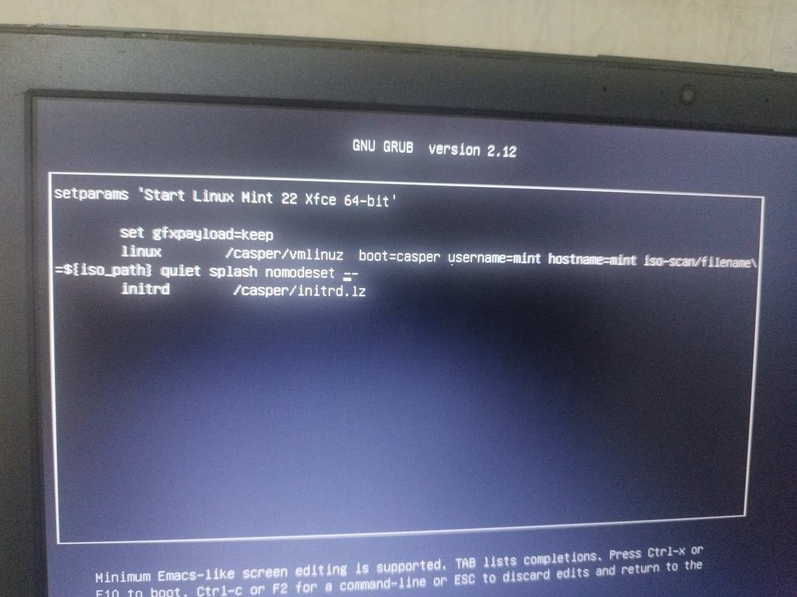
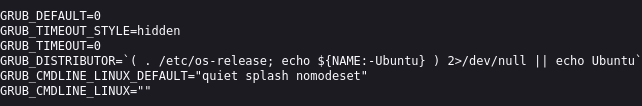

# Diagnóstico e Soluções para Problemas de Sistema no Linux

Este guia descreve comandos e procedimentos para diagnosticar e solucionar problemas no sistema Linux, principalmente relacionados a gráficos, inicialização e logs do sistema. Ao longo dos anos, eu, Lya, me deparei com diversos problemas como usuária de Linux. Muitos desses erros foram resolvidos com os comandos aqui apresentados, que se mostraram eficazes repetidamente. Por isso, compartilho este material com você.
Utilizei muitas distribuições, como Ubuntu, KDE Plasma, Xubuntu, Mint, entre outras. Meu computador sempre exigiu a adição de "nomodeset" para que o sistema pudesse iniciar corretamente após a instalação. Além disso, enfrentei outros erros que o Linux apresentou ao longo da minha jornada como usuária.

---

---


## 1. Registro de Logs com `tail`

### Salvar Logs em um Arquivo
```bash
tail -f /var/log/syslog > syslog_error.log
```
- Monitora o arquivo `/var/log/syslog` em tempo real e salva os logs em `syslog_error.log`.
- Útil para capturar eventos enquanto realiza uma ação específica.

### Adicionar Logs ao Arquivo Existente
```bash
tail -f /var/log/syslog >> syslog_error.log
```
- Similar ao comando anterior, mas adiciona os logs ao final do arquivo sem sobrescrever o conteúdo existente.

### Verificar o Conteúdo do Arquivo
```bash
cat syslog_error.log
```
- Exibe o conteúdo do arquivo de logs para revisão.

---

## 2. Logs do Kernel com `dmesg`

### Visualizar Logs do Kernel
```bash
sudo dmesg | less
```
- Mostra mensagens do kernel, incluindo erros de hardware e inicialização.
- Use o comando `less` para navegar pelo conteúdo.

---

## 3. Verificação de Logs com `journalctl`

### Logs de Erros do Kernel e Sistema
```bash
sudo journalctl -k -p 3 -xb
```
- Exibe mensagens de erro críticas do kernel na inicialização atual:
  - `-k`: Mostra logs do kernel.
  - `-p 3`: Filtra mensagens de erro (nível crítico).
  - `-xb`: Exibe logs da sessão atual.

### Logs em Tempo Real
```bash
sudo journalctl -f -u lightdm
```
- Monitora os logs do serviço `lightdm` em tempo real.

---

## 4. Iniciar o LightDM Manualmente

### Executar o LightDM
```bash
sudo lightdm
```
- Inicia o gerenciador de login `lightdm` manualmente e exibe mensagens de erro diretamente no terminal.

---

## 5. Verificar Logs do Xorg

### Logs de Erros do Xorg
```bash
cat /var/log/Xorg.0.log | grep EE
```
- Filtra e exibe apenas as linhas de erro do log do Xorg.

---

## 6. Configuração de `nomodeset` no GRUB

### Configuração Temporária
1. No menu do GRUB, selecione a opção de inicialização.
2. Pressione **`e`** para editar.
3. Localize a linha que contém `quiet splash`.
4. Adicione `nomodeset` após `quiet splash`:
   ```
   quiet splash nomodeset
   ```
5. Pressione **`F10`** ou **`Ctrl + X`** para iniciar com a configuração.

### Configuração Permanente
```bash
sudo nano /etc/default/grub
```
- Edite a linha:
  ```bash
  GRUB_CMDLINE_LINUX_DEFAULT="quiet splash nomodeset"
  ```
- Salve as alterações com `Ctrl + O` e saia com `Ctrl + X`.
- Atualize o GRUB:
  ```bash
  sudo update-grub
  ```
- Reinicie o sistema.

---

## 7. Atualização do Sistema

### Comandos de Atualização
```bash
sudo apt update
sudo apt upgrade
sudo apt full-upgrade
sudo apt autoremove
```
- **`update`**: Atualiza a lista de pacotes disponíveis.
- **`upgrade`**: Instala atualizações para os pacotes já instalados.
- **`full-upgrade`**: Atualiza pacotes e instala novas dependências, se necessário.
- **`autoremove`**: Remove pacotes desnecessários.

---

## 8. Logs de Sessão do Usuário

### Verificar `.xsession-errors`
```bash
cat ~/.xsession-errors
```
- Exibe erros relacionados à sessão gráfica do usuário.

### Filtrar Logs do LightDM
```bash
sudo journalctl -xe | grep lightdm
```
- Filtra mensagens relacionadas ao `lightdm` nos logs do sistema.

---

## 9. Configuração do GRUB via Terminal

1. **Editar o GRUB**:
   ```bash
   sudo nano /etc/default/grub
   ```
2. **Adicionar Opções Temporárias**:
   - Selecione a opção de inicialização no GRUB.
   - Pressione **`e`**, edite `quiet splash`, e adicione `nomodeset`.
  
   - 
   
3. **Aplicar Alterações Permanentemente**:
   ```bash
   sudo update-grub
   ```

---

## 10. Resolução de Problemas Gráficos com `nomodeset`

- No menu GRUB:
  1. Pressione `e` para editar.
  2. Encontre a linha `quiet splash`.
  3. Adicione `nomodeset` após `quiet splash`.
  4. Pressione **`Ctrl + X`** para continuar a inicialização.

- Para tornar permanente:
  ```bash
  sudo nano /etc/default/grub
  ```
  - Altere a linha:
    ```
    GRUB_CMDLINE_LINUX_DEFAULT="quiet splash nomodeset"

    
    ```
  - Salve e atualize:
    ```bash
    sudo update-grub
    ```
    Print da tela, como ficaria permanentemente:
    
    - 

---

# Gerenciadores de Login e Ambientes Gráficos no Linux

## LightDM e GDM3

LightDM e GDM3 são apenas dois dos vários gerenciadores de login disponíveis, e cada distribuição pode escolher qual usa como padrão. As escolhas variam dependendo do ambiente gráfico e do foco da distribuição.

Aqui está uma visão geral de como as distribuições geralmente escolhem o gerenciador de login:

- **Ubuntu** – Usa GDM3 com o ambiente GNOME. Em versões anteriores, com Unity ou com ambientes mais leves, ele usava o LightDM.
- **Kali Linux** – Usa GDM3 com o GNOME, mas pode mudar para LightDM ou SLiM ao usar ambientes leves, como XFCE.
- **Debian** – Permite escolher entre GDM3, LightDM, SDDM, ou SLiM na instalação. A escolha depende do ambiente gráfico selecionado (GNOME, XFCE, KDE, etc.).
- **Arch Linux** – É minimalista e não vem com nenhum gerenciador de login instalado por padrão. O usuário escolhe qual quer instalar: GDM3 para GNOME, LightDM para XFCE ou MATE, e SDDM para KDE, por exemplo.
- **Manjaro** – Usa o gerenciador de login que corresponde ao ambiente: GDM3 para a versão GNOME, LightDM para XFCE e SDDM para KDE.
- **Linux Mint** – Usualmente vem com LightDM nas edições Cinnamon, MATE e XFCE, pois é mais leve e bem integrado.

Essas são as combinações mais comuns, mas, em muitas distribuições, você pode trocar o gerenciador de login por aquele que melhor se adapta às suas preferências e necessidades.

Cada ambiente gráfico é independente e pode ser instalado no mesmo sistema sem interferir nos outros. Quando você instala um novo ambiente gráfico, ele se torna apenas uma "camada" adicional que você pode escolher na tela de login. Isso **não afeta** o ambiente gráfico já instalado.

## Cinnamon e XFCE no Linux Mint

- **Linux Mint XFCE** e **Linux Mint Cinnamon** são duas edições diferentes do Linux Mint. A edição XFCE vem com o ambiente gráfico XFCE (mais leve), enquanto a edição Cinnamon vem com o Cinnamon (desenvolvido pelo próprio Linux Mint, mais moderno e com mais efeitos visuais).
- Não há problema algum em usar o Cinnamon no Linux Mint XFCE. Na prática, você está usando o Mint com o ambiente gráfico que escolher na tela de login (XFCE ou Cinnamon), sem rodar “em cima” de outro. Quando você faz login no Cinnamon, você está usando só o Cinnamon, não o XFCE. Eles são ambientes gráficos independentes.

## LightDM e GDM3

- **LightDM** e **GDM3** são gerenciadores de login (ou "Display Managers"). Eles são responsáveis por fornecer a tela de login onde você escolhe o usuário e o ambiente gráfico.
- **LightDM** é mais leve e muitas vezes usado em ambientes leves como XFCE e MATE.
- **GDM3** é mais pesado e comumente usado em ambientes GNOME, como no Ubuntu padrão.
- O gerenciador de login é independente do ambiente gráfico, então você pode usar LightDM ou GDM3 com Cinnamon, XFCE, KDE, etc.
- Se o LightDM está dando problemas de logout inesperado, você pode evitar usá-lo, mas isso não afeta diretamente a maioria dos ambientes gráficos, que podem ser usados com diferentes gerenciadores de login.

---

## Trocar o Ambiente Gráfico na Tela de Login
Na tela de login, você pode escolher o ambiente gráfico desejado (XFCE, Cinnamon, KDE, etc.). Quando você seleciona um, **somente ele será carregado**, e os outros não ficarão ativos em segundo plano.

É como escolher uma roupa: você usa apenas uma por vez, mas pode trocar quando quiser.

---

### Comandos para Alternar Entre LightDM e GDM3:

- Para voltar ao **LightDM**:
  ```bash
  sudo dpkg-reconfigure lightdm
  ```

- Para configurar o **GDM3** como gerenciador de login:
  ```bash
  sudo dpkg-reconfigure gdm3
  ```

## Instalação do Android Studio

- Android Studio pode ser instalado em qualquer ambiente (XFCE, Cinnamon, etc.) e estará acessível em todos. Não importa em qual ambiente você instala o Android Studio; ele ficará disponível no sistema e poderá ser acessado independentemente do ambiente que você escolher no login.
- A diferença de ambiente gráfico pode afetar a interface, mas não altera o funcionamento do Android Studio.

## O Que São LightDM e GDM3?

- **LightDM** e **GDM3** são programas que controlam a tela de login e gerenciam o início da sessão gráfica. Eles não são ambientes gráficos; apenas gerenciam a interface de login e o início das sessões.
- Eles não fazem parte essencial das distribuições, mas muitas distribuições escolhem um deles como padrão. Você pode trocá-los livremente na maioria das distribuições.

## O Que É Cinnamon?

- **Cinnamon** é um ambiente gráfico. Ele fornece a interface visual completa (painéis, janelas, menus) para o usuário, assim como o XFCE, KDE Plasma e GNOME.
- Cinnamon é o ambiente gráfico desenvolvido pelo Linux Mint e é o padrão para a edição Cinnamon do Linux Mint. Ele não é um gerenciador de login e não depende de LightDM ou GDM3.

## Por Que Outras Sessões como Ubuntu e KDE Plasma Aparecem na Tela de Login?

- As opções de Ubuntu e KDE Plasma que aparecem na tela de login provavelmente se referem a sessões gráficas alternativas que foram instaladas ou detectadas pelo sistema. Isso pode ocorrer se você tiver pacotes de outros ambientes ou sessões alternativas.
- Você pode escolher essas opções na tela de login para experimentar esses ambientes. Cada ambiente gráfico funciona de forma independente, então rodar uma sessão KDE ou Ubuntu não significa que o XFCE ou o Cinnamon estejam "rodando por baixo".

## Resumo

- **Ambientes Gráficos** (como XFCE, Cinnamon, KDE, GNOME): Controlam a interface gráfica completa.
- **Gerenciadores de Login** (LightDM, GDM3): Controlam apenas a tela de login e o início das sessões.
- Você pode escolher qual ambiente gráfico e qual gerenciador de login prefere. Eles são intercambiáveis na maioria das distribuições, e você não está limitado a apenas um.

---

## Verificar Ambientes Gráficos e Gerenciadores de Login Instalados

### 1. Verificar os Ambientes Gráficos Instalados

Para listar os ambientes gráficos instalados, use:

```bash
dpkg -l | grep -E 'cinnamon|xfce4|plasma-desktop|gnome-shell|mate-desktop'
```

### 2. Verificar o Ambiente Gráfico Atual

Para descobrir qual ambiente gráfico está em uso atualmente:

```bash
echo $DESKTOP_SESSION
```

### 3. Verificar os Gerenciadores de Login Instalados

Para listar os gerenciadores de login instalados:

```bash
dpkg -l | grep -E 'lightdm|gdm3|sddm'
```

### 4. Verificar o Gerenciador de Login Ativo

Para verificar qual gerenciador de login está ativo no momento:

```bash
systemctl status display-manager
```

---

## KDE Plasma e Linux Mint

- O KDE Plasma é outro ambiente gráfico completo, assim como o Cinnamon, o XFCE e o GNOME. Ele oferece uma interface visual rica e personalizável, com foco em efeitos visuais, alta personalização e produtividade.

### Comando para Instalar KDE Plasma no Linux Mint:

```bash
sudo apt install kde-plasma-desktop
```

Após instalar o KDE Plasma, ele aparecerá como uma opção na tela de login, e você poderá alternar entre os ambientes (Cinnamon, XFCE, KDE, etc.).

---


## Tem Problema Instalar Vários Ambientes Gráficos?
**Não, não há problema!** Você pode instalar múltiplos ambientes gráficos no mesmo sistema. O sistema operacional (como Linux Mint ou Ubuntu) continuará funcionando normalmente, independentemente do ambiente gráfico escolhido.

---

## O "Coração" do Sistema Operacional
- O "coração" do sistema é o próprio **sistema operacional**, como **Linux Mint**, **Ubuntu**, **Fedora**, ou **Arch**.
- O ambiente gráfico (XFCE, Cinnamon, KDE, etc.) é apenas uma interface para interagir com esse sistema.
- **Conclusão**: Não importa qual ambiente gráfico você usa; o "coração" continua sendo o sistema operacional.

---

## Instalar Outros Ambientes Gráficos
Você pode adicionar qualquer ambiente gráfico ao seu sistema. Por exemplo:
- No **Linux Mint XFCE**, você pode instalar o **Cinnamon** ou o **KDE Plasma**.
- No **Ubuntu**, você pode adicionar **XFCE Mint** ou **Cinnamon**.

Após instalá-los, eles estarão disponíveis na tela de login.

---

## Instalar o Linux Mint Cinnamon vs. Linux Mint XFCE
- **Linux Mint Cinnamon**: Se você instala a edição Cinnamon, ele virá com o Cinnamon como ambiente gráfico padrão.
- **Linux Mint XFCE**: Na edição XFCE, o ambiente gráfico padrão será o XFCE.

Em ambos os casos, o sistema operacional ainda será o **Linux Mint**, e a diferença será apenas o ambiente gráfico inicial.

---

## Diferença Entre Plugins e Ferramentas do XFCE e Cinnamon
- Se você instalar o Linux Mint Cinnamon, ele usará ferramentas como:
  - **cinnamon-settings** (configurações do sistema),
  - **cinnamon-sound-settings** (controle de som),
  - **cinnamon-terminal**.
- No Linux Mint XFCE, as ferramentas padrão são:
  - **xfce4-panel** (painel),
  - **xfce4-settings** (configurações),
  - **xfce4-power-manager** (gerenciamento de energia).

Se você instalar o Cinnamon em um sistema Mint XFCE, ambos os conjuntos de ferramentas estarão disponíveis, mas somente o ambiente ativo (Cinnamon ou XFCE) usará suas próprias ferramentas.
---

---

### 2. Problema: Uso excessivo de swap, deixando o sistema lento
#### Solução:
Reduza o "swappiness" para priorizar o uso de RAM antes de usar o swap:
1. Verifique o valor atual de `swappiness`:
    ```bash
    cat /proc/sys/vm/swappiness
    ```
2. Reduza o valor para algo entre 10 e 20:
    ```bash
    sudo sysctl vm.swappiness=10
    ```
3. Para tornar a mudança permanente:
    ```bash
    sudo nano /etc/sysctl.conf
    ```
    Adicione ou edite a linha:
    ```
    vm.swappiness=10
    ```

---


### 3. Problema: Erros ao acessar logs ou sistema travando
#### Comando Útil:
Verifique os logs do sistema para entender o problema:
```bash
journalctl -xe
```
Filtre logs por data ou serviço:
```bash
journalctl --since "2024-11-01" --until "2024-11-14"
journalctl -u NetworkManager.service
```

---

### 4. Problema: Diretório /tmp cheio, causando problemas em aplicativos
#### Solução:
Limpe manualmente o `/tmp`:
```bash
sudo rm -rf /tmp/*
```
Configure a limpeza automática no reinício:
```bash
sudo nano /etc/systemd/tmpfiles.d/tmp.conf
```
Adicione as linhas:
```
d /tmp 1777 root root 1d
```

---

### 5. Curiosidade: Comando pouco conhecido para recuperação de pacotes quebrados
Use o `dpkg` para resolver pacotes quebrados:
```bash
sudo dpkg --configure -a
sudo apt --fix-broken install
```

---

### 6. Problema: Erro ao montar dispositivos USB ou drives
#### Solução:
Force a montagem manual:
```bash
sudo mount /dev/sdX1 /mnt
```
Se necessário, verifique erros no dispositivo:
```bash
sudo fsck /dev/sdX1
```

---

### 7. Problema: Consumo alto de CPU por serviços desnecessários
#### Solução:
Identifique os serviços ativos:
```bash
systemctl list-units --type=service
```
Desative serviços não utilizados:
```bash
sudo systemctl disable nome_do_servico
sudo systemctl stop nome_do_servico
```

---

### Dicas e Truques Adicionais

- **Liberando Memória Sem Reiniciar**:
    Use este comando para limpar o cache de memória:
    ```bash
    sudo sync; echo 3 > /proc/sys/vm/drop_caches
    ```

- **Melhorando o Desempenho de Gráficos em Sistemas Antigos**:
    Edite o `/etc/X11/xorg.conf` para configurar drivers leves, como `vesa`.

- **Descubra Processos Consumindo Recursos Excessivos**:
    ```bash
    top
    htop
    ```

---

### Ferramentas Recomendadas

- **htop**: Monitor de recursos do sistema mais avançado que o `top`.
- **ncdu**: Análise de uso de disco interativa.
- **tmux**: Gerenciador de sessões em terminais.

---

## Visualizar Memória RAM e Swap

### Ver o uso de RAM e Swap
```bash
free -h
```
Exibe informações da memória RAM e Swap de forma amigável.

**Exemplo de saída:**
```
              total        used        free      shared  buff/cache   available
Mem.:          7,6Gi       2,1Gi       4,7Gi        45Mi       1,1Gi       5,5Gi
Swap:          2,0Gi          0B       2,0Gi
```

### Detalhes avançados sobre a memória
```bash
cat /proc/meminfo
```
Exibe informações detalhadas da memória no sistema.

---

## Apagar Caches

### Limpar caches para liberar memória
```bash
sudo sh -c "echo 3 > /proc/sys/vm/drop_caches"
```
**Aviso:** Este comando limpa as páginas de cache do sistema. Não afeta processos ativos, mas deve ser usado com cautela.

### Explicação dos valores:
- `1`: Limpa caches de páginas de memória.
- `2`: Limpa caches de dentries e inodes.
- `3`: Limpa tudo (páginas de memória, dentries e inodes).

---

## Diminuir o Uso de Swap

### Verificar o valor atual de swappiness
```bash
cat /proc/sys/vm/swappiness
```
**Valor padrão:** Geralmente 60, o que significa que o sistema usa Swap mais cedo.

### Reduzir o uso de Swap
```bash
sudo sysctl vm.swappiness=10
```
Altera temporariamente o swappiness para priorizar mais a RAM.

### Tornar a alteração permanente
Edite o arquivo `/etc/sysctl.conf`:
```bash
sudo nano /etc/sysctl.conf
```
Adicione ou edite a linha:
```
vm.swappiness=10
```
Salve e saia (`Ctrl + O`, `Ctrl + X`).

## Dicas e Comandos Úteis

### Ver informações sobre hardware
```bash
lshw -short
```

### Checar logs de falhas
```bash
journalctl -p err -b
```
Exibe logs de erro da sessão atual.

### Remover pacotes não utilizados
```bash
sudo apt autoremove
```
Remove pacotes antigos e desnecessários.

### Apagar arquivos temporários
```bash
sudo rm -rf /tmp/*
```

### Listar pacotes instalados
```bash
dpkg --get-selections
```

### Atualizar a lista de repositórios e pacotes
```bash
sudo apt update && sudo apt upgrade -y
```

---

### Testar conexões de rede diretamente no terminal
```bash
curl -Is https://google.com | head -n 1
```
Verifica se há conexão com a internet.

---

Reiniciar o sistema

```bash
sudo reboot
```

---


# Monitorando a Temperatura da CPU e GPU no Linux

## 1. Instalar o pacote lm-sensors
Este pacote é necessário para monitorar sensores de temperatura e outros dados de hardware.

```bash
sudo apt update
sudo apt install lm-sensors
```

## 2. Detectar Sensores Disponíveis
Após a instalação, execute o seguinte comando para detectar os sensores no seu sistema:

```bash
sudo sensors-detect
```

Responda "Yes" para as perguntas quando solicitado.

## 3. Verificar Temperatura
Após detectar os sensores, use o comando abaixo para exibir a temperatura em tempo real:

```bash
sensors
```

## 4. Monitoramento em Tempo Real
Para um monitoramento contínuo da temperatura:

```bash
watch sensors
```

Pressione `Ctrl + C` para sair.


## Conclusão

Este guia é um recurso prático para resolver problemas comuns no Linux e otimizar o desempenho do sistema. As soluções aqui apresentadas foram testadas e comprovadas úteis ao longo dos anos.

Se você tiver dúvidas ou quiser contribuir com novas dicas, fique à vontade para compartilhar!
